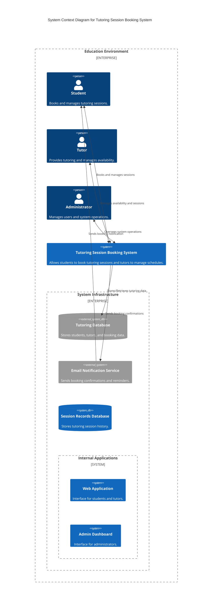
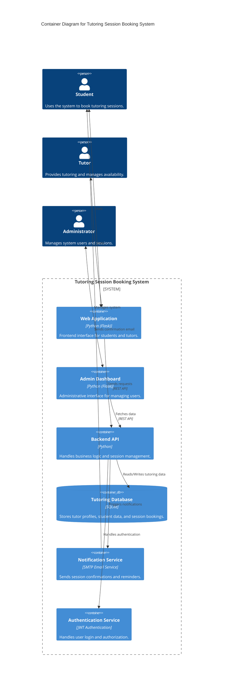
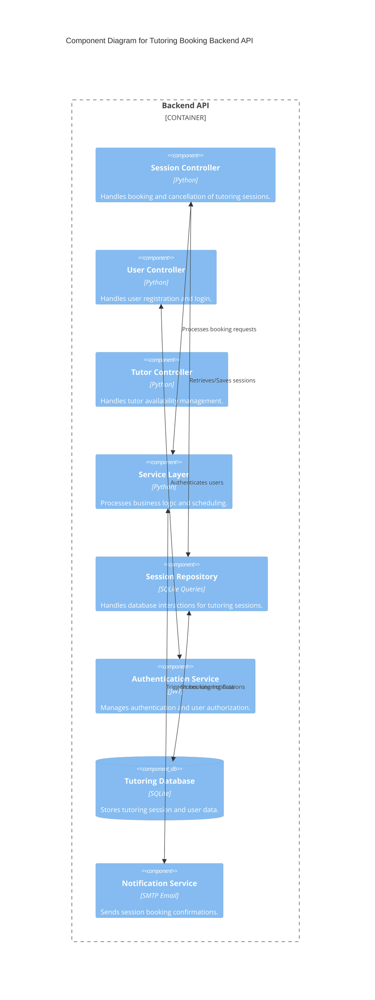
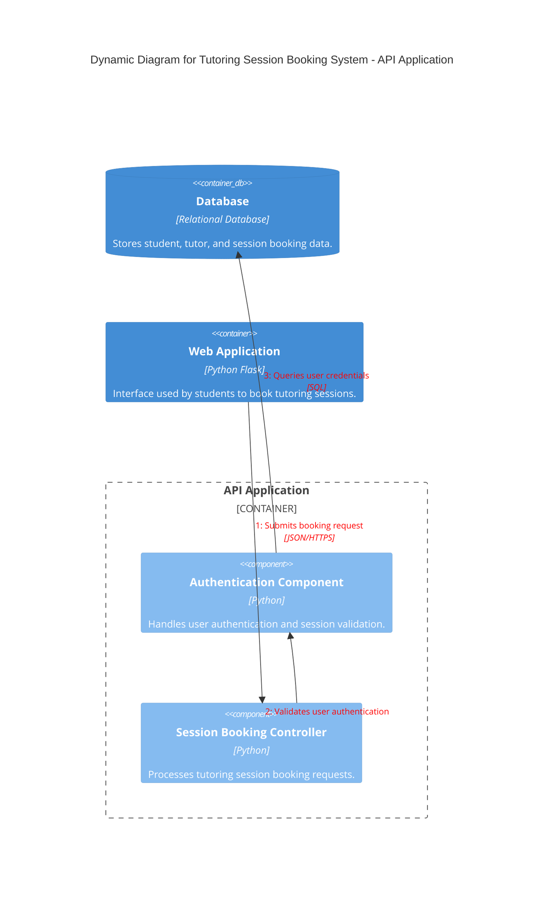

# C4 Architectural Diagrams

## Project Title
Tutoring Session Booking System

## Domain
Education Technology

The Tutoring Session Booking System is designed to help students easily schedule tutoring sessions with available tutors. The system provides a centralized platform where students can browse tutors, book sessions, and manage their bookings. Tutors can manage their availability and view scheduled tutoring sessions. Administrators oversee the system and manage users.

The platform simplifies tutoring coordination by organizing tutor availability, session bookings, and communication between students and tutors.

---

# Problem Statement

Educational institutions often struggle with organizing tutoring sessions effectively. Common challenges include:

1. **Scheduling Conflicts**  
Students and tutors often struggle to coordinate schedules when bookings are handled manually.

2. **Lack of Centralized Information**  
Tutor availability and session bookings may be scattered across multiple communication platforms.

3. **Manual Booking Processes**  
Manual scheduling increases the risk of errors and overlapping bookings.

4. **Poor Communication**  
Students may not receive confirmations or reminders for scheduled tutoring sessions.

The Tutoring Session Booking System solves these problems by providing a centralized platform where tutoring sessions can be scheduled and managed efficiently.

---

# Individual Scope

The system provides the following functionality:

1. **Student Booking System**  
Students can browse tutors and schedule tutoring sessions.

2. **Tutor Availability Management**  
Tutors can set and manage their available time slots.

3. **Session Scheduling**  
The system ensures that bookings do not conflict with tutor availability.

4. **User Authentication**  
Users must log in before accessing the system.

5. **User Management**  
Administrators manage user accounts and monitor system activity.

6. **Session Data Storage**  
All tutoring sessions and user information are stored in a database.

---

# Architecture

---

# System Context Diagram (C4 Level 1)

The System Context Diagram shows how the Tutoring Session Booking System interacts with external users and services.

## Key Components

1. Student  
A user who books tutoring sessions.

2. Tutor  
A user who provides tutoring sessions and manages availability.

3. Administrator  
Manages system users and oversees platform operations.

4. Tutoring Session Booking System  
The main system responsible for scheduling tutoring sessions.

5. Tutoring Database  
Stores tutor profiles, student accounts, and booking data.

6. Web Application  
Interface used by students and tutors.

7. Admin Dashboard  
Interface used by administrators.

8. Email Notification Service  
Sends booking confirmations and reminders.

9. Session Records Database  
Stores historical tutoring session data.

---

## Interactions

Students use the Tutoring Session Booking System to browse tutors and schedule tutoring sessions.

Tutors interact with the system to manage availability and tutoring schedules.

Administrators manage users and monitor system activity.

The system stores and retrieves data from the Tutoring Database.

The system sends booking confirmation notifications using the Email Notification Service.

The Email Notification Service sends booking confirmations to students.

---

## Container Diagram (C4 Level 2)

The Container Diagram shows the main applications and services that make up the tutoring booking system.

### Key Containers

- **Web Application**  
  Interface used by students and tutors to interact with the system.

- **Admin Dashboard**  
  Interface used by administrators to manage users.

- **Backend API**  
  Handles application logic and session management.

- **Tutoring Database**  
  Stores tutor information, student accounts, and session bookings.

- **Notification Service**  
  Handles sending session confirmations and reminders.

- **Authentication Service**  
  Handles login authentication and user authorization.

### Interactions

- Students and tutors interact with the Web Application to use the tutoring system.
- Administrators use the Admin Dashboard to manage system data.
- The Web Application sends requests to the Backend API.
- The Admin Dashboard communicates with the Backend API to retrieve system information.
- The Backend API stores and retrieves tutoring data from the Tutoring Database.
- The Backend API uses the Authentication Service to verify user credentials.
- The Backend API triggers the Notification Service to send booking confirmations.

## Component Diagram (C4 Level 3)

The Component Diagram shows the internal components of the Backend API.

### Key Components

- **Session Controller**  
  Handles tutoring session booking and cancellation.

- **User Controller**  
  Handles user registration and authentication.

- **Tutor Controller**  
  Manages tutor availability.

- **Service Layer**  
  Processes business logic for session scheduling.

- **Session Repository**  
  Handles database operations.

- **Authentication Service**  
  Handles user authentication.

- **Tutoring Database**  
  Stores user and session data.

- **Notification Service**  
  Sends session booking confirmations.

### Interactions

- The Session Controller processes booking requests and passes them to the Service Layer.
- The User Controller communicates with the Authentication Service to authenticate users.
- The Session Controller retrieves and stores session information using the Session Repository.
- The Session Repository reads and writes data to the Tutoring Database.
- The Service Layer triggers the Notification Service to send booking confirmations.

## Dynamic Diagram (C4 Level 4)

The Dynamic Diagram shows how a tutoring session booking request flows through the system.

### Interaction Flow

1. A student submits a tutoring session booking request using the Web Application.
2. The request is sent to the Backend API.
3. The Backend API validates the user using the Authentication Component.
4. The booking information is stored in the database.

