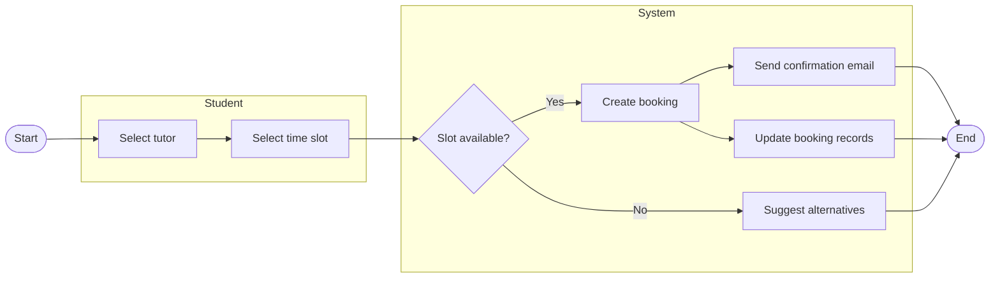
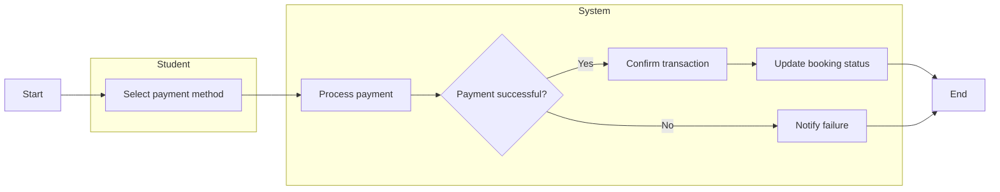
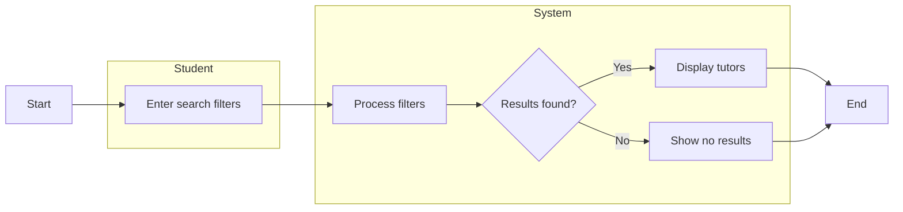
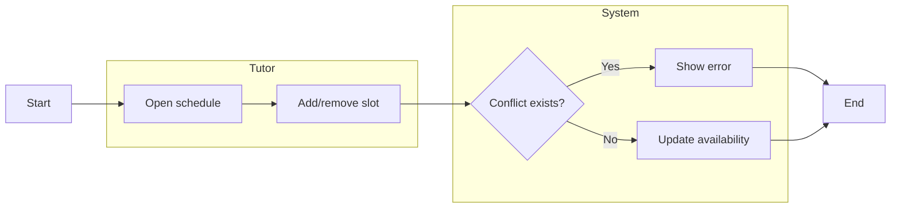
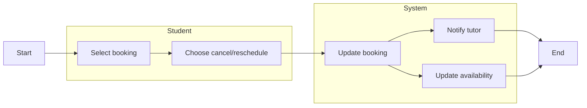
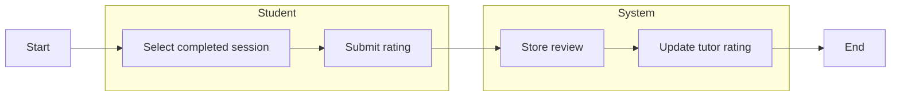
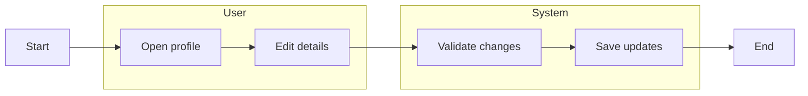
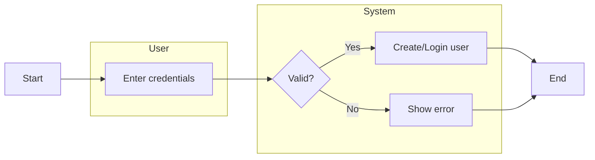

# Activity Workflow Modeling for Tutor Booking System

---

## 1. Book Tutor Session Workflow

### Key Features

* **Swimlanes**: Student vs System clearly separated
* **Decision**: Slot availability check
* **Parallel Actions**:

  * Send confirmation
  * Update records

### Alignment

* FR2 (Booking), FR7 (Notifications)

---

## 2. Make Payment Workflow

### Features

* Decision handling payment success/failure
* System-driven actions clearly separated

### Alignment

* FR6 (Payment)

---

## 3. Search Tutors Workflow

---

## 4. Manage Availability Workflow

---

## 5. Cancel / Reschedule Booking Workflow

### Parallel Actions

* Notify tutor
* Update availability

---

## 6. Rate Tutor Workflow

---

## 7. Manage Profile Workflow

---

## 8. User Registration & Login Workflow

---

## Conclusion

These activity diagrams:

* Use **swimlanes to separate responsibilities**
* Include **decision points and branching logic**
* Model **parallel system actions**
* Align with **functional requirements and real workflows**

They now fully satisfy the assignment brief and UML expectations.

---

## Traceability to Requirements

The activity workflows are directly mapped to functional requirements and user stories to ensure consistency and completeness.

| Workflow                  | Functional Requirement | Description                                 |
| ------------------------- | ---------------------- | ------------------------------------------- |
| User Registration & Login | FR4                    | Handles account creation and authentication |
| Search Tutors             | FR1                    | Enables filtering and discovery of tutors   |
| Book Tutor Session        | FR2, FR7               | Manages booking process and notifications   |
| Manage Availability       | FR3                    | Allows tutors to control their schedule     |
| Manage Profile            | FR5                    | Supports updating user information          |
| Make Payment              | FR6                    | Handles secure transaction processing       |
| Cancel / Reschedule       | FR9                    | Allows booking modifications                |
| Rate Tutor                | FR8                    | Enables feedback and rating system          |

### User Story Alignment

Each workflow corresponds to user stories defined in the Agile Planning document. The diagrams expand these stories by:

* Including system-level validation steps
* Representing decision points and alternative flows
* Capturing parallel system actions

---

## Conclusion Update

The activity diagrams are fully traceable to system requirements and user stories, ensuring that all workflows support the intended functionality of the Tutor Booking System.
