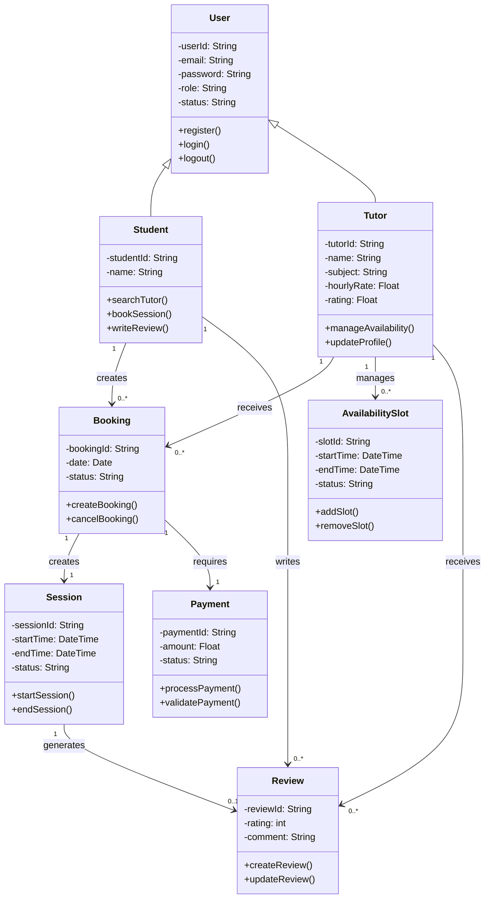

# Class Diagram for Tutor Booking System

---

## Design Decisions

* **Inheritance used** for User → Student/Tutor to avoid duplication
* **Booking and Session separated** to distinguish reservation vs execution
* **Payment linked to Booking** to enforce transaction validation
* **Multiplicity defined** to reflect real-world constraints

---

## Alignment with Previous Assignments

* Use Cases: Booking, Payment, Review workflows
* Activity Diagrams: Booking & payment flows
* State Diagrams: Booking lifecycle, session lifecycle

This ensures consistency across all system models.
