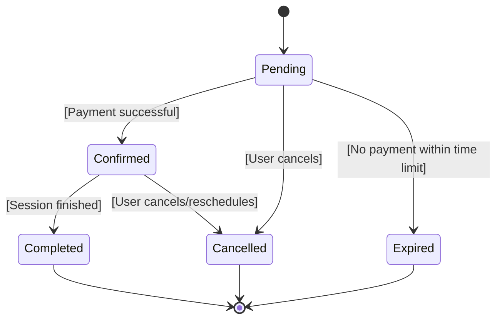
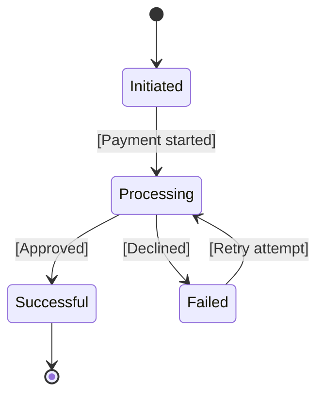
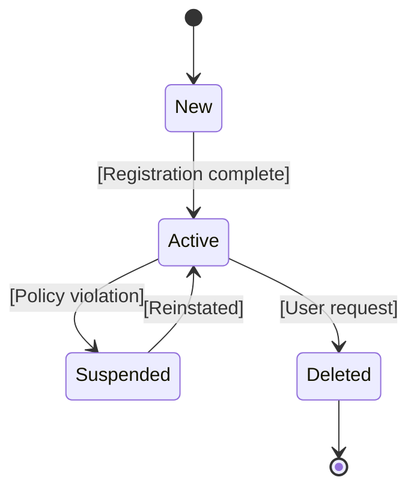
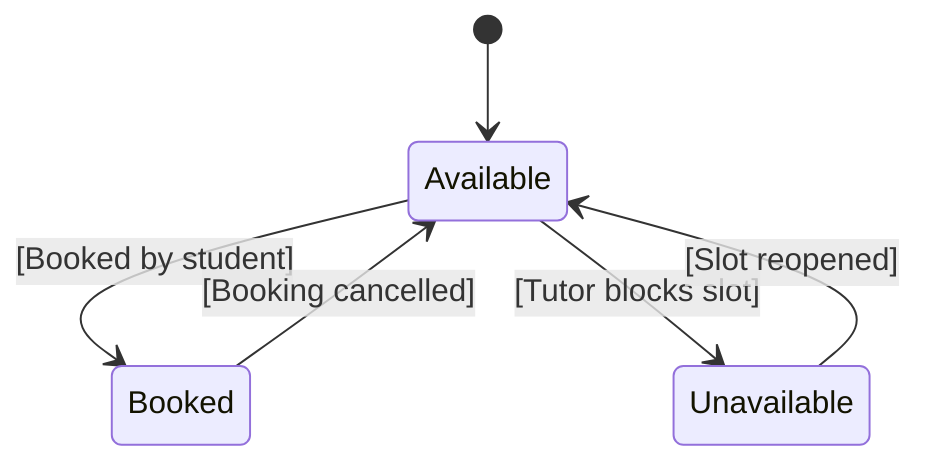
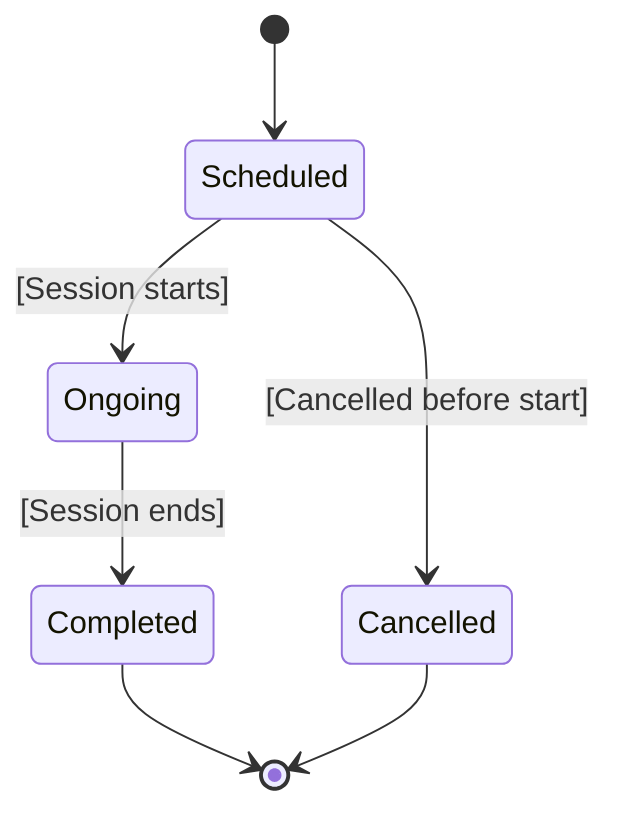
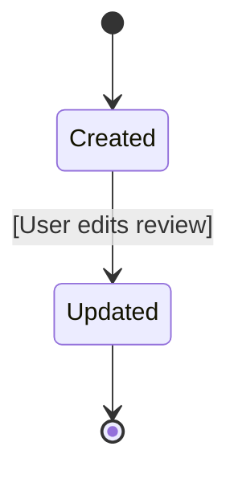
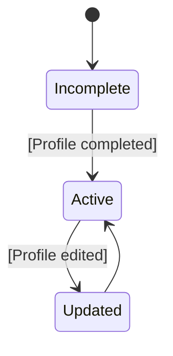

# Object State Modeling for Tutor Booking System

---

## 1. Booking Object State Diagram

### Key States

* **Pending**: Booking has been created but is awaiting payment confirmation
* **Confirmed**: Payment has been successfully processed and the session is scheduled
* **Cancelled**: Booking has been cancelled by the user or system
* **Expired**: Booking automatically cancelled due to inactivity or timeout
* **Completed**: Session has been successfully conducted

### Transitions

* *Pending → Confirmed*: Triggered when payment is successfully processed
* *Pending → Cancelled*: Triggered by user cancellation
* *Pending → Expired*: Occurs when payment is not completed within a defined time
* *Confirmed → Completed*: Session lifecycle reaches completion
* *Confirmed → Cancelled*: User initiates cancellation or rescheduling

### Alignment with Requirements

* FR2 (Booking System)
* FR6 (Payment Processing)
* FR9 (Cancel/Reschedule)

### Interpretation

This state model ensures that bookings follow a controlled lifecycle, preventing inconsistent states such as unpaid confirmed bookings while supporting cancellation and timeout handling.

---

## 2. Payment Object State Diagram

### Key States

* **Initiated**: Payment process has been started
* **Processing**: Payment is being verified by the system
* **Successful**: Transaction completed successfully
* **Failed**: Payment attempt unsuccessful

### Transitions

* *Initiated → Processing*: Payment request is submitted
* *Processing → Successful*: Payment approved
* *Processing → Failed*: Payment declined
* *Failed → Processing*: User retries payment

### Alignment with Requirements

* FR6 (Secure Online Payments)
* NFR (Security & Reliability)

### Interpretation

The payment lifecycle ensures reliability and allows retry mechanisms, preventing transaction loss and improving user experience.

---

## 3. User Account State Diagram

### Key States

* **New**: User has initiated registration
* **Active**: Account is operational
* **Suspended**: Account temporarily restricted
* **Deleted**: Account permanently removed

### Transitions

* *New → Active*: Successful registration
* *Active → Suspended*: Policy violation
* *Suspended → Active*: Account reinstated
* *Active → Deleted*: User deletes account

### Alignment with Requirements

* FR4 (User Registration & Login)

### Interpretation

This lifecycle supports user management and security by allowing suspension and deletion mechanisms.

---

## 4. Availability Slot State Diagram

### Key States

* **Available**: Slot open for booking
* **Booked**: Slot reserved
* **Unavailable**: Slot removed or blocked

### Transitions

* *Available → Booked*: Student books slot
* *Booked → Available*: Booking cancelled
* *Available → Unavailable*: Tutor removes slot
* *Unavailable → Available*: Slot re-added

### Alignment with Requirements

* FR3 (Manage Availability)

### Interpretation

Ensures schedule integrity and prevents double booking.

---

## 5. Session State Diagram

### Key States

* **Scheduled**: Session planned
* **Ongoing**: Session in progress
* **Completed**: Session finished
* **Cancelled**: Session terminated

### Transitions

* *Scheduled → Ongoing*: Session begins
* *Ongoing → Completed*: Session ends
* *Scheduled → Cancelled*: Cancelled before start

### Alignment with Requirements

* FR2 (Booking System)
* FR9 (Cancel/Reschedule)

### Interpretation

Represents execution phase of bookings and ensures proper tracking of session progress.

---

## 6. Review Object State Diagram

### Key States

* **Created**: Review submitted
* **Updated**: Review modified

### Transitions

* *Created → Updated*: User edits review

### Alignment with Requirements

* FR8 (Rating System)

### Interpretation

Supports feedback updates while maintaining simplicity.

---

## 7. Tutor Profile State Diagram

### Key States

* **Incomplete**: Profile not fully set up
* **Active**: Profile visible
* **Updated**: Profile modified

### Transitions

* *Incomplete → Active*: Profile completed
* *Active → Updated*: Profile edited
* *Updated → Active*: Changes applied

### Alignment with Requirements

* FR5 (Profile Management)

### Interpretation

Ensures profiles remain accurate and usable for tutor discovery.

---

## Conclusion

The object state diagrams comprehensively model the lifecycle of key system entities. They incorporate UML best practices such as guard conditions and event-driven transitions while maintaining strong alignment with functional requirements and system behavior.

---

## Traceability to Requirements

The object state diagrams are aligned with functional requirements to ensure that each entity lifecycle supports system behavior.

| Object            | Functional Requirement | Description                                         |
| ----------------- | ---------------------- | --------------------------------------------------- |
| Booking           | FR2, FR6, FR9          | Booking lifecycle, payment validation, cancellation |
| Payment           | FR6                    | Payment processing and retry handling               |
| User Account      | FR4                    | User registration and account management            |
| Availability Slot | FR3                    | Tutor scheduling and slot management                |
| Session           | FR2, FR9               | Session execution and cancellation                  |
| Review            | FR8                    | Feedback and rating system                          |
| Tutor Profile     | FR5                    | Profile creation and updates                        |

### Consistency with Activity Diagrams

* State transitions correspond to actions in activity workflows
* Example:

  * Payment workflow → triggers Booking state change (Pending → Confirmed)
  * Booking workflow → leads to Session lifecycle transitions

---

## Conclusion Update

The object state diagrams maintain full traceability to functional requirements and are consistent with activity workflows, ensuring a coherent representation of system behavior.
