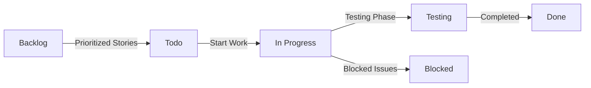

### GitHub Project Template Analysis for Tutor Booking System

To effectively manage the Tutor Booking System project, various GitHub Project templates were evaluated. These templates provide different workflows, levels of automation, and support for Agile practices. The goal is to select the most suitable template to manage tasks derived from Assignment 6, including user stories and sprint backlog activities.

---

## Comparison Table of GitHub Project Templates

| Template              | Columns/Workflow                              | Automation Features                                      | Suitability for Agile                          |
|----------------------|-----------------------------------------------|----------------------------------------------------------|-----------------------------------------------|
| Basic Kanban         | To Do → In Progress → Done                    | No automation; tasks moved manually                     | Low. Too simple and lacks backlog management  |
| Automated Kanban     | To Do → In Progress → Done                    | Automatically moves issues when pull requests are merged | Moderate. Supports continuous delivery        |
| Bug Triage           | Triage → High Priority → Fix → Done           | Auto-labels issues based on keywords                    | Low. Focused on bug fixing, not feature work  |
| Team Planning        | Backlog → Todo → In Progress → Done           | Supports milestones, scheduling, and progress tracking  | High. Strong alignment with Agile workflows   |

---

### Justification: Team Planning Template

The **Team Planning** template is the most suitable choice for the Tutor Booking System project for the following reasons:

#### 1. Alignment with Agile Practices
The template closely follows Agile principles by incorporating a **Backlog**, which allows for prioritization of user stories such as:
- User registration and login (US1)
- Tutor search functionality (US2)
- Booking system (US3)

The workflow from `Backlog → Todo → In Progress → Done` reflects a typical Agile sprint cycle, making it ideal for managing the sprint backlog created in Assignment 6.

---

#### 2. Effective Sprint Management
The template supports the use of **milestones**, which can represent sprints. For example:
- Sprint 1: Core Features (authentication, search, booking)

Tasks such as:
- T1: Develop user registration API  
- T6: Implement booking system API  
- T12: Write unit tests  

can be grouped and tracked efficiently within a sprint.

---

#### 3. Improved Workflow Visibility
The inclusion of a **Backlog column** ensures that all tasks are visible and prioritized before being worked on. This helps:
- Prevent confusion about task order  
- Improve planning and organization  
- Provide clear progress tracking for stakeholders  

---

#### 4. Automation and Efficiency
Although not fully automated like Automated Kanban, the Team Planning template supports:
- Linking issues to milestones  
- Tracking progress automatically  
- Managing task flow more efficiently  

This reduces manual effort while maintaining structured control over the workflow.

---

#### 5. Scalability and Flexibility
The template can easily scale as the system grows. Future features such as:
- Payment integration  
- Tutor ratings  
- Booking notifications  

can be added to the backlog without restructuring the board.

---

### Why Other Templates Were Not Selected

- **Basic Kanban**: Too simplistic and lacks backlog management, making it unsuitable for structured Agile development.
- **Automated Kanban**: While useful for automation, it does not support backlog prioritization or sprint planning effectively.
- **Bug Triage**: Focuses mainly on handling bugs rather than developing new features, which does not align with the goals of this project.

---

### Example Workflow Implementation

1. **Backlog**: Contains all prioritized user stories from Assignment 6  
2. **Todo**: Includes selected sprint tasks (T1–T12)  
3. **In Progress**: Tasks currently being developed  
4. **Done**: Completed tasks  

Additional columns such as:
- **Testing** (for QA validation)  
- **Blocked** (for tasks with dependencies or issues)  

will be added to improve workflow tracking and meet Assignment 7 requirements.

---

### Workflow Visualization

