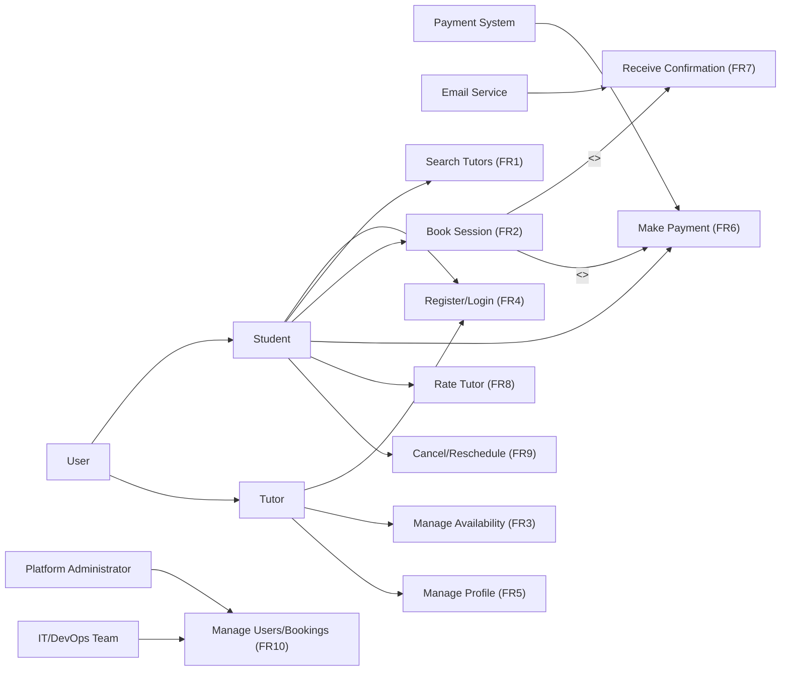

# Use Case Diagram 

---

#### **Explanation of the Use Case Diagram**

1. **Key Actors and Roles**:
    - **Platform Administrator**: Manages users and bookings through the admin dashboard.
    - **Tutor**: Sets availability, manages profile, and delivers tutoring sessions.
    - **Student**: Searches for tutors, books sessions, makes payments, and rates tutors.
    - **Payment System**: Processes secure online payments.
    - **Email Service**: Sends booking confirmations and notifications.
    - **IT/DevOps Team**: Monitors system performance and ensures uptime.

2. **Relationships**:
    - **Generalization**: Student and Tutor inherit from a general "User" actor, as both interact with the system but have different permissions.
    - **Inclusion**:
        - Booking a session includes making a payment.
        - Booking a session includes sending a confirmation email.
    - **Dependency**:
        - Notifications depend on the email service.
        - Payment processing depends on the external payment system.

3. **Alignment with Stakeholder Concerns**:
    - **Students**: Use cases like "Search Tutors" and "Book Session" address ease of booking and availability concerns.
    - **Tutors**: "Manage Availability" and "Manage Profile" support flexible scheduling and visibility.
    - **Platform Administrators**: "Manage Users/Bookings" ensures system control and data accuracy.
    - **Finance/Payment Stakeholders**: "Make Payment" ensures secure and reliable transactions.
    - **IT/DevOps Team**: System interactions ensure performance, scalability, and uptime requirements are maintained.